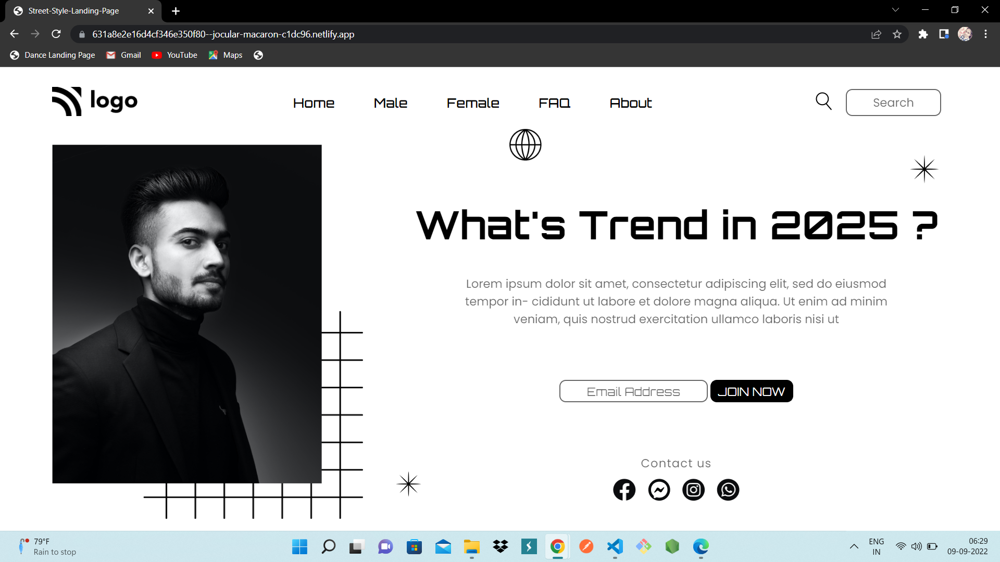

# Hii Dear,This is ADDEPALLI BHAVANA👋

## PROJECT NAME: Street Style Landing Page

### **💻TECH STACK USED IN THIS PROJECT:** 

### **🛠WHAT I HAVE LEARNT FROM THIS PROJECT:** 
- CSS Positions(Relative,Absolute)
- CSS Flex-box
- CSS Selectors

### **⌛TIME TAKEN TO COMPLETE THIS PROJECT:** 
- I have taken 2 hours to complete this project.

### **👀HOW MY PROJECT LOOKS LIKE:**

### 💻It works only in **LAPTOP**(Not Responsive).

### **🚀LIVE LINK:**
-  This project is hosted on **Netlify**.You can Check it live using below link: 
-  [Project Live Link !](https://631a8e2e16d4cf346e350f80--jocular-macaron-c1dc96.netlify.app/)

