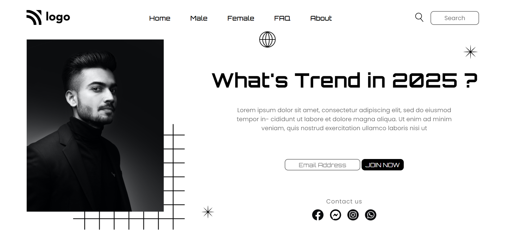

# Hii Dear,This is **Addepalli Bhavana**👋

## Project Name: **Street Style Landing Page**

### **💻Tech Stack Used In This Project:** 

### **🛠What I Have Learnt From This Project:** 
- CSS Positions(Relative,Absolute)
- CSS Flex-box
- CSS Selectors

### **⌛Time Taken To Complete This Project:** 
- I have taken 2 hours to complete this project.

### **👀How My Project looks like:**

### 💻It works only in **LAPTOP**(Not Responsive).

### **🚀Live Link:**
-  This project is hosted on **Netlify**.You can Check it live using below link: 
-  [Project Live Link !](https://631a8e2e16d4cf346e350f80--jocular-macaron-c1dc96.netlify.app/)

